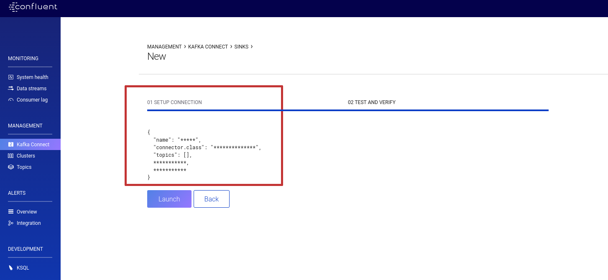

## Ejercicio 1 KSQL

Tenemos un sistema de sondas con el que monitorizamos temperatura y humedad. Estas sondas publican sus 
datos en un topic de kafka (samples). Los sensores se pueden monitorizar o no, para ello se publican 
en un topic de kafka si queremos que esten monitorizados (topic sondas). 

El ejercicio consiste en, mediante KSQL, crear un topic con la información de las sondas monitorizadas.
El formato de salida debe ser avro (puedes hacer las pruebas usando json si es más cómodo, 
pero el formato final debe ser avro  

#### Generador de datos sondas

Generador de datos de las sondas
```bash
source env/bin/activate
python -m ejercicios/final_1/gen_samples.py -b localhost:9092 -t samples -c 1.5 -n 10
```

Canal de publicación: **samples**

Formato de los mensajes de topic

* Clave: Número con el id del sensor
* Valor: Json con un formato similar a este
```json
{"id": 9, "name": "Sensor 9", "temp": 29, "damp": 0.85}
```

#### Generador de estado de las sondas. 

Comando para ejecutar los datos de sondas actuivas

```bash
source env/bin/activate
python -m ejercicios/final_1/gen_sondas.py -b localhost:9092 -t sondas -c 1.5 -n 10 -H 0.9
```

Topic: **sondas**

Formato de los mensajes del topic

* Clave: Número con el id del sensor
* Valor: `True` o `False`

## Ejercicio 2. Apache Spark Structured Streaming

Se pide hacer un wordcount en spark structured streaming con las siguientes condiciones
 * Leer de origen de un topic de kafka
 * Escribir el resultado a otro topic de kafka
 * El resultado debe mostrarse para el último minuto. (Ventana de un minuto) 

## Ejercicio 3, Kafka Connect. 

En este ejercicio se pide volcar los resultados del ejercicio 1 en una tabla sqlite.

El entregable es el json de configuración que aparece en la interfaz web al crear la tarea en el servidor de kafka connect. En el control center 
se muestra antes de crear el conector



